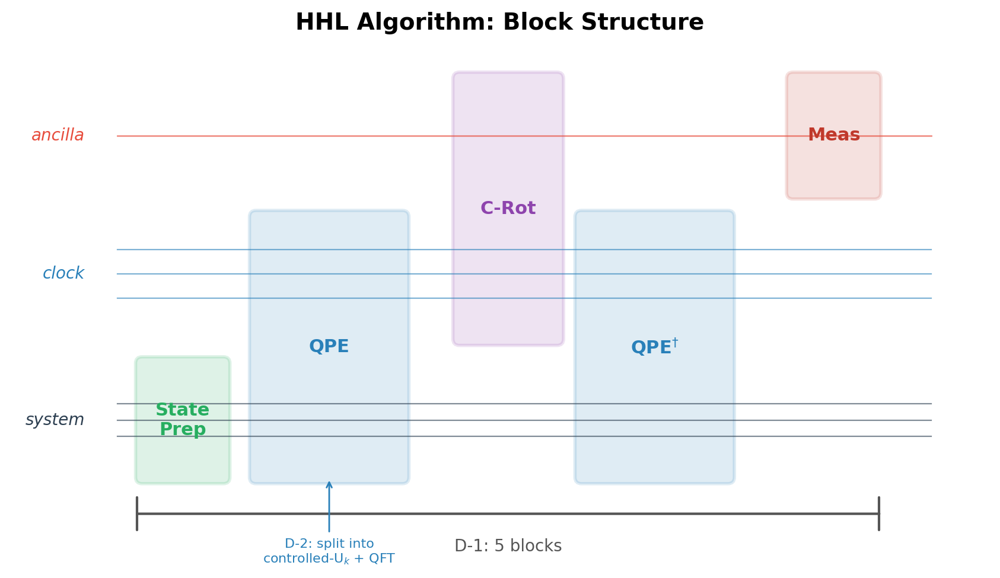
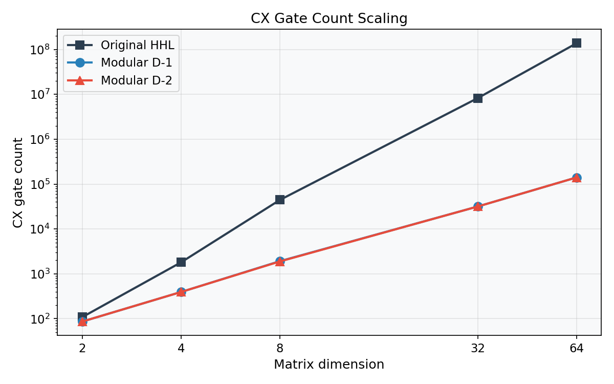
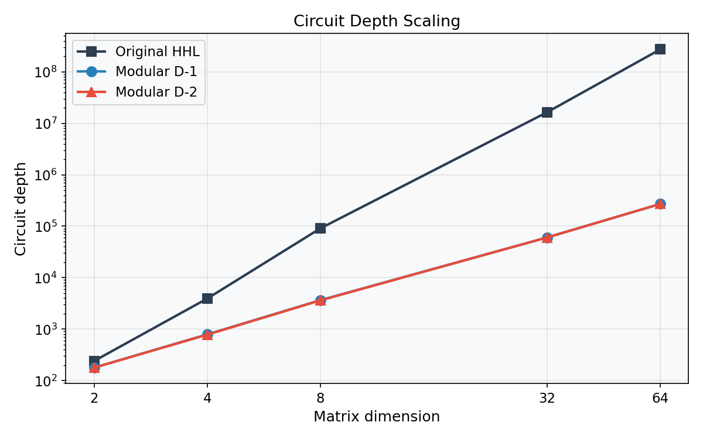
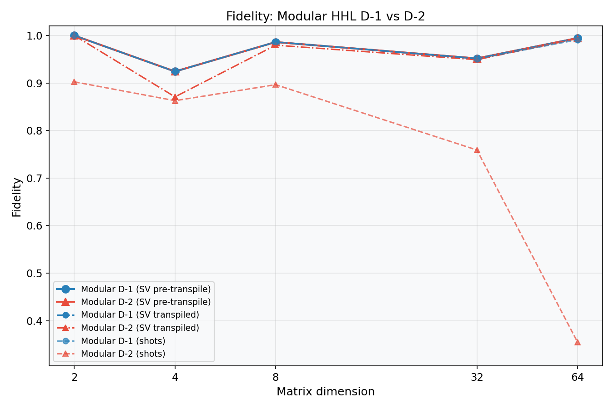
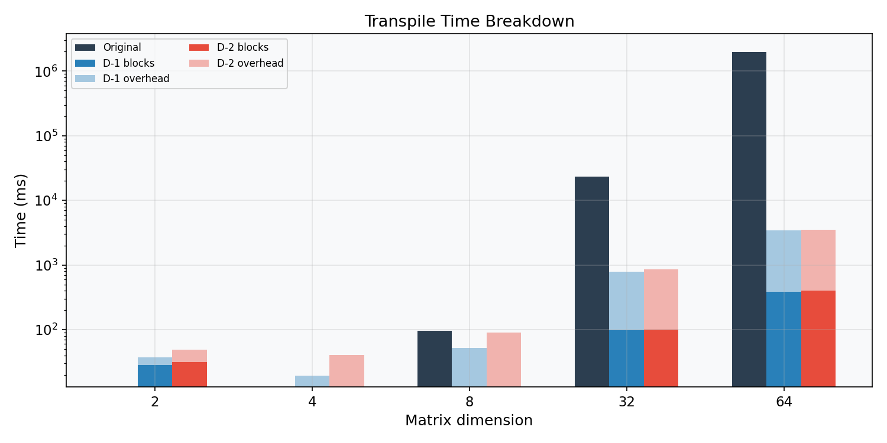
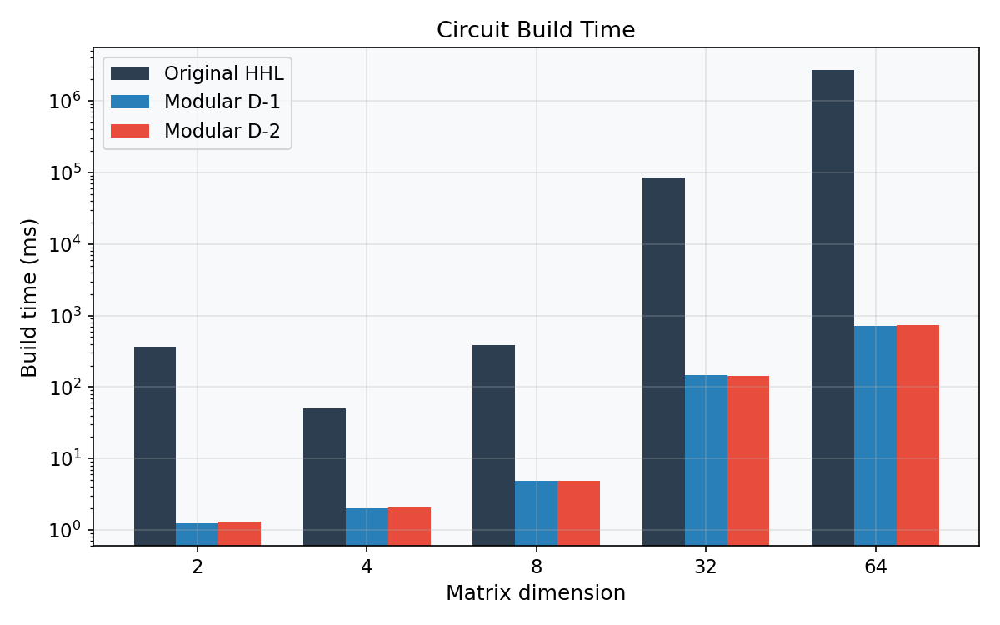

# Modular HHL Transpilation: Scaling Analysis

**Date:** 2026-03-20
**Workflow:** `_4a00736d`
**Sweep config:** `q8020-cfd-axequalsb/input/hhl_scaling.toml`
**Problem:** Tridiagonal linear systems Ax=b at N = 2, 4, 8, 32, 64, where A has diagonal 2 and off-diagonals -1 (1D Laplacian)
**Variants:** Original HHL, Modular D-1 (top-level blocks), Modular D-2 (QPE sub-blocks)

---

## 1. Overview

This analysis compares three HHL transpilation strategies across five problem sizes spanning 5 to 19 qubits. All three variants use the same `linear_solvers.HHL` implementation (the library used in the `frontier_qlsa` experiments). The difference is in how the resulting circuit is transpiled:

- **Original:** Monolithic transpilation of the full HHL circuit.
- **Modular D-1:** The circuit is decomposed into 5 top-level blocks (`state_prep`, `qpe`, `controlled_rotations`, `inverse_qpe`, `measurement`), each transpiled independently and stitched with layout chaining.
- **Modular D-2:** Further decomposes QPE into individual `controlled_u_k` stages and QFT blocks, yielding 11-29 blocks depending on problem size.

All variants use Qiskit `optimization_level=0`, `seed=42`, and 65,536 shots.

### Distinction from Circuit Cutting

The term "cut and stitch" in the quantum computing literature typically refers to techniques that partition a circuit across multiple smaller quantum processors, introducing classical communication overhead and an exponential sampling cost proportional to the number of cuts. The modular transpilation described here is fundamentally different: it operates entirely at compile time. The circuit is decomposed into blocks for *transpilation* only; the blocks are stitched back into a single monolithic circuit before any execution occurs. There is no runtime overhead, no classical communication between fragments, and no sampling penalty. The final circuit runs on a single backend as a single job.

### Scope and Limitations

Transpilation is not commutative with circuit decomposition: transpiling a circuit as a whole and transpiling its constituent blocks independently do not in general produce the same result. The monolithic transpiler has global visibility across the entire circuit DAG — it can exploit long-range gate cancellations, perform global routing optimization, and apply resynthesis across block boundaries. Modular transpilation sacrifices this global view in exchange for reduced per-block complexity. The net effect depends on the algorithm, the decomposition, and the transpiler's optimization level. In the HHL case at `optimization_level=0`, the trade-off is favorable because the transpiler's O(0) passes do not exploit global structure, so little is lost by restricting visibility to individual blocks.

This technique is algorithm-specific. The D-1 decomposition exploits the fact that HHL has a natural sequential block structure where qubit register roles are preserved across boundaries. Other algorithms may not decompose as cleanly. Algorithms with extensive cross-register entanglement, non-sequential control flow, or blocks that share intermediate state may not admit a decomposition where layout chaining is straightforward. Each target algorithm requires its own analysis to identify natural block boundaries and determine whether modular transpilation yields a net benefit.

At higher Qiskit optimization levels, the trade-off may shift. At `optimization_level=2` or `3`, the monolithic transpiler applies passes (commutative analysis, gate resynthesis, peephole optimization) that can reduce gate counts across the full circuit. Modular transpilation at these levels may forfeit optimizations that span block boundaries. Conversely, as observed in this work, aggressive optimization levels can corrupt small modular blocks — the transpiler's resynthesis heuristics may not be well-tested on the small, irregular DAGs that result from fine-grained decomposition.

### Basis Gate Selection

The target basis gate set is `{cx, id, rz, sx, x}`. This matches the native gate set of IBM's Eagle and Heron processors and is the standard choice for Qiskit transpilation targeting IBM hardware. The `cx` (CNOT) gate is the sole two-qubit entangling gate, making CX count a good proxy for circuit error on these devices.

---

## 2. CX Gate Count Scaling

| N | Original | D-1 | D-2 | D-1 Reduction |
|---|----------|-----|-----|---------------|
| 2 | 108 | 86 | 86 | 20% |
| 4 | 1,801 | 393 | 393 | 78% |
| 8 | 44,356 | 1,914 | 1,888 | 96% |
| 32 | 8,242,014 | 31,615 | 31,613 | 99.6% |
| 64 | 137,823,697 | 140,596 | 140,588 | 99.9% |

CX reduction grows with problem size. At N=64, modular HHL produces a circuit with 1000x fewer CX gates. D-1 and D-2 produce nearly identical CX counts because both use the same build-time decomposition strategy; the difference is only in how blocks are grouped for transpilation.

The original HHL's CX growth stems from its monolithic unitary construction: the full HHL circuit is built as a single composite gate and the transpiler must decompose it from scratch. The modular approach decomposes controlled-U blocks at build time, producing tighter circuits before the transpiler runs.

---

## 3. Circuit Depth Scaling

| N | Original | D-1 | D-2 |
|---|----------|-----|-----|
| 2 | 241 | 179 | 179 |
| 4 | 3,938 | 793 | 783 |
| 8 | 91,178 | 3,673 | 3,632 |
| 32 | 16,318,766 | 60,407 | 60,383 |
| 64 | 271,449,158 | 270,420 | 270,384 |

Depth tracks CX count closely (gate count / depth ratio near 1.4), indicating nearly serial circuit structure. This is expected for HHL's sequential QPE structure and suggests that idle-time mitigation techniques such as dynamical decoupling might be effective on real hardware.

---

## 4. Fidelity

| N | D-1 SV (pre) | D-1 SV (trans) | D-1 Shots | D-2 SV (pre) | D-2 SV (trans) | D-2 Shots |
|---|-------------|---------------|-----------|-------------|---------------|-----------|
| 2 | 1.000 | 1.000 | 1.000 | 1.000 | 1.000 | 0.903 |
| 4 | 0.924 | 0.924 | 0.924 | 0.924 | 0.871 | 0.863 |
| 8 | 0.986 | 0.986 | 0.987 | 0.986 | 0.980 | 0.897 |
| 32 | 0.952 | 0.952 | 0.951 | 0.952 | 0.949 | 0.759 |
| 64 | 0.995 | 0.995 | 0.991 | 0.995 | 0.994 | 0.355 |

Three fidelity metrics are reported for each modular variant. **SV (pre-transpile)** is computed by running the modular circuit (before transpilation to basis gates) on the Aer statevector simulator, post-selecting on the ancilla qubit, and comparing the resulting state to the classical solution. **SV (transpiled)** repeats this measurement on the transpiled circuit, running it directly on Aer without re-transpilation to avoid introducing additional qubit permutations; any difference between pre- and post-transpile SV fidelity isolates the error introduced by the transpilation process itself. **Shots** fidelity uses the standard shot-based simulator with ancilla post-selection on measurement outcomes, and is sensitive to both transpilation error and finite sampling.

**D-1** statevector fidelity is preserved through transpilation at all tested sizes (pre- and post-transpile values are identical to three decimal places), confirming that the D-1 block decomposition and stitching process does not introduce measurable unitary error. Shot-based fidelity remains above 0.92, with the gap from SV fidelity attributable to finite-shot sampling variance.

**D-2** shows progressive shot-fidelity degradation, reaching 0.355 at N=64, while statevector fidelity remains above 0.99. Each independently transpiled block introduces small numerical errors from floating-point matrix factorization during unitary synthesis. These errors accumulate multiplicatively across 10-28 block boundaries. The statevector fidelity is largely unaffected because the solution direction is preserved; it is the ancilla post-selection probability that degrades, reducing the effective number of post-selected samples available for fidelity estimation.

**Effective post-selected samples.** HHL encodes the solution conditioned on the ancilla qubit measuring |1>. The fraction of shots that pass this post-selection (the success probability) determines the effective sample count:

| N | D-1 Samples | D-2 Samples |
|---|------------|------------|
| 2 | 21,359 | 22,300 |
| 4 | 25,207 | 6,473 |
| 8 | 21,129 | 1,668 |
| 32 | 5,756 | 210 |
| 64 | 4,546 | 52 |

At 65,536 total shots, D-1 retains thousands of effective samples at all tested sizes. D-2 at N=64 yields only 52 post-selected samples, which is insufficient for reliable fidelity estimation and accounts for much of the observed shot-fidelity drop. Increasing shot count would partially compensate but at significant computational cost: achieving the same effective sample count as D-1 at N=64 would require approximately 5.7 million shots.

This is an inherent trade-off: finer block decomposition gives better per-block visibility but worse phase coherence across the full circuit.

For D-1, the success probability decreases with N (from 0.33 at N=2 to 0.07 at N=64) as the HHL eigenvalue inversion step yields a lower success probability for larger, more ill-conditioned systems. This cost is intrinsic to the HHL algorithm, not introduced by modular transpilation: the D-1 pre-transpile and post-transpile success probabilities are identical, confirming that the block decomposition and stitching process preserves the algorithm's native success probability. Any HHL implementation — monolithic or modular — faces the same shot scaling for a given matrix. Maintaining adequate post-selected sample counts at larger N will require scaling the shot budget roughly as O(1/p_success). At N=64 with p_success=0.07, 65,536 shots yield ~4,500 effective samples; scaling to N=256 or beyond, where success probability may drop below 0.01, would require on the order of 10^6 shots to maintain comparable sample quality. This is a property of the HHL algorithm itself, not of the modular transpilation approach.

---

## 5. Transpile Time

| N | Original (s) | D-1 (s) | D-2 (s) | Speedup (Orig/D-1) |
|---|-------------|---------|---------|-------------------|
| 2 | 0.012 | 0.038 | 0.049 | 0.3x |
| 4 | 0.009 | 0.019 | 0.040 | 0.5x |
| 8 | 0.096 | 0.052 | 0.091 | 1.8x |
| 32 | 23.5 | 0.789 | 0.858 | 30x |
| 64 | 1,960 | 3.41 | 3.53 | 575x |

At small sizes (N=2, 4) the modular overhead exceeds the monolithic transpile time. The crossover occurs at N=8. By N=64, modular transpilation is 575x faster because the transpiler's superlinear passes (routing, commutation analysis) operate on smaller DAGs. Each of D-1's 5 blocks is transpiled independently. Layout chaining between blocks is inherent in the D-1 decomposition: the HHL algorithm's block structure naturally preserves qubit register assignments across block boundaries, as is visible in high-level circuit renderings. This particular D-1 decomposition is algorithm-specific, reflecting the sequential structure of HHL (state preparation, QPE, rotation, inverse QPE, measurement).

The modular overhead visible at small N consists of: (1) the post-stitch optimization pass, which runs unitary-preserving gate cancellation across block boundaries on the full stitched circuit, and (2) per-block bookkeeping (layout extraction, block metadata). At N=2, the sum of per-block transpile times is 28ms but total D-1 time is 38ms, with the 10ms difference being this overhead. The overhead grows sub-linearly with circuit size and becomes negligible relative to the per-block transpile cost at larger N.

D-1 and D-2 transpile times are similar because D-2's additional blocks are individually small (~10ms each).

---

## 6. Circuit Build Time

| N | Original (s) | D-1 (s) | D-2 (s) | Speedup |
|---|-------------|---------|---------|---------|
| 2 | 0.36 | 0.001 | 0.001 | 360x |
| 4 | 0.05 | 0.002 | 0.002 | 25x |
| 8 | 0.39 | 0.005 | 0.005 | 78x |
| 32 | 85.5 | 0.147 | 0.145 | 582x |
| 64 | 2,666 | 0.724 | 0.739 | 3,682x |

The original HHL constructs the full Hamiltonian simulation unitary as a monolithic gate at O(N^3). The modular approach builds each controlled-U block independently, yielding sub-second build times at N=64.

At N=64, the original takes 44 minutes to build the circuit (before transpilation). Modular HHL builds in 0.7 seconds.

---

## 7. Key Findings

1. **Modular D-1 achieves 99.9% CX reduction at N=64** while maintaining statevector fidelity above 0.95 and shot-based fidelity above 0.92 at all tested sizes. Further validation is needed at larger scales and on real hardware before drawing conclusions about production readiness.

2. **D-2 decomposition reveals a fidelity-granularity trade-off.** Finer decomposition of the QPE block into individual controlled-U stages causes cumulative phase error across block boundaries. At N=64 the D-2 shot fidelity drops to 0.355 while D-1 remains at 0.991. The D-1 decomposition preserves QPE as a single transpilation unit, avoiding this accumulation.

3. **The resource savings grow with problem size.** Combined build and transpile time drops from 77 minutes (original, N=64) to 4.1 seconds (D-1), a ratio that increases with N. This "the more you spend, the more you save" characteristic suggests modular transpilation becomes increasingly advantageous as problem sizes scale beyond what was tested here. This is particularly relevant in iterative scenarios such as the iterative HHL approach used for the FVM 1D nozzle case, where the circuit must be rebuilt and transpiled at each iteration — reducing per-iteration compile cost from minutes to seconds changes the feasibility of the overall workflow.

4. **The seam optimization pass is unitary-preserving.** It performs gate cancellations (`InverseCancellation`, `CommutativeInverseCancellation`, `Optimize1qGatesDecomposition`) that reduce gate count without altering the circuit's logical function. The D-2 fidelity loss originates from accumulated numerical error in per-block unitary synthesis, not from the stitching process.

5. **Stress-testing Qiskit tooling uncovered bugs.** During development, we encountered a Rust panic in Qiskit's `TwoQubitWeylDecomposition` (issue #4159) triggered by specific unitary matrices during `qs_decomposition`. The workaround required cascading through all four `(opt_a1, opt_a2)` flag combinations, catching `BaseException` from each. We also observed that Qiskit `optimization_level=2` corrupts D-2 circuits through aggressive gate resynthesis that destroys circuit semantics for small modular blocks. These findings illustrate that probing the boundaries of quantum tooling at scale can surface correctness issues not encountered in standard usage.

---

## 8. Configuration

- **Software:** Qiskit 2.3.1, qiskit-aer 0.17.2, Python 3.12.10
- **Transpilation:** `optimization_level=0`, `seed=42`
- **Basis gates:** `{cx, id, rz, sx, x}`
- **Shots:** 65,536
- **Sizes:** N = 2, 4, 8, 32, 64 (N=16 omitted due to pathological QPE phase alignment at kappa=117)
- **Results:** `results/modular_hhl/2026-03-20/_4a00736d/`

---

## 9. Next Steps

1. **QPE-specific decomposition heuristic.** The D-2 decomposition of the D-1 QPE block applies a generic tree-flattening strategy that does not account for the phase relationships between controlled-U stages. A QPE-aware decomposition heuristic could potentially maintain inter-block phase coherence while still enabling per-stage transpilation. Whether such a heuristic exists without sacrificing the modularity benefits is an open question.

2. **Generalization to other algorithms.** The D-1 decomposition exploits the specific sequential structure of HHL. A study of other quantum algorithms (e.g., VQE, QAOA, quantum walks) and their natural block decompositions is needed to determine how broadly modular transpilation applies and what algorithm-specific decomposition strategies are required. Longer term, if sufficient algorithm-specific decompositions are catalogued, automatic modular decomposition could become a transpilation pre-step: given an arbitrary circuit, an AI-assisted pattern matching system trained on known algorithm structures could identify block boundaries, register roles, and layout-chaining opportunities without manual annotation. This would allow modular transpilation to be applied as a general-purpose compiler optimization rather than requiring per-algorithm engineering.

3. **Uncertainty quantification.** The current results use a single seed and a single matrix family. UQ studies across multiple random seeds, condition numbers, matrix structures, and shot counts are needed to characterize the variance of both fidelity and transpilation metrics.

4. **Further scale-up.** The tested range (5-19 qubits) is within the reach of classical simulation. Scaling to 25+ qubits would test the modular approach in regimes where monolithic transpilation becomes infeasible and where noise effects on real hardware dominate.

5. **Combination with other techniques.** Modular transpilation is orthogonal to other circuit optimization strategies. Combining with approaches such as LuGo could yield further CX reductions.

6. **Parallel transpilation.** Because each block is transpiled independently, the per-block transpile calls are embarrassingly parallel. The current implementation runs them sequentially, but at large N where per-block transpile times grow, distributing blocks across multiple cores or nodes could further reduce wall-clock compile time. For D-1 at N=64 the 5 blocks could be transpiled in parallel, reducing the effective transpile time to that of the single largest block.

7. **Dynamical decoupling.** The near-serial circuit structure (depth/gate ratio ~1.4) indicates substantial idle time on inactive qubits. Dynamical decoupling sequences inserted during these idle periods may improve fidelity on real hardware. This is only relevant for noise-model or hardware execution, not ideal simulation.
